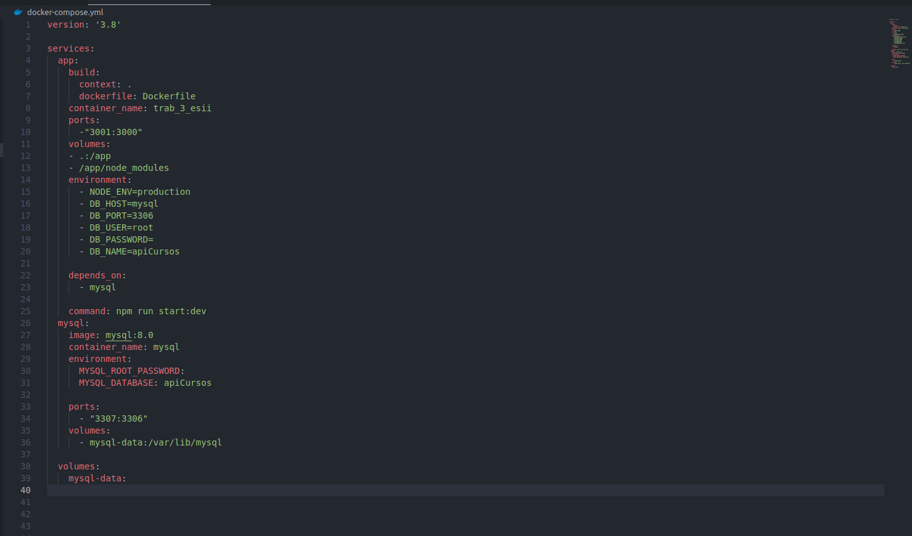

Integrantes do trabalho:
- Luis Felipe Quineper Junior   
- Lucas Lettnin
- Pedro Martins Vergara

## Descrição
Este Pull Request contém a configuração de Docker para a aplicação Node.js e MySQL. Foram adicionados o `Dockerfile` e o `docker-compose.yml` para criar e orquestrar os containers.

### Arquivos Adicionados
- `Dockerfile`
- `docker-compose.yml`

## Tipo de mudança

- [ ] Bug fix (mudança que corrige um problema)
- [ ] Nova feature (mudança que adiciona uma funcionalidade)
- [ ] Refatoração (mudança que melhora o código sem alterar a funcionalidade)
- [ ] Outro (descreva abaixo):

## Como foi testado?

<!-- Descreva os testes realizados para verificar suas mudanças -->
Para testar as mudanças, siga os passos abaixo:

no terminal, digite os comandos
npm init -y
npm i prisma 
npx prisma migrate dev --name {nomeDoBanco}

1. **Build e Start dos containers:**
   docker-compose up --build

